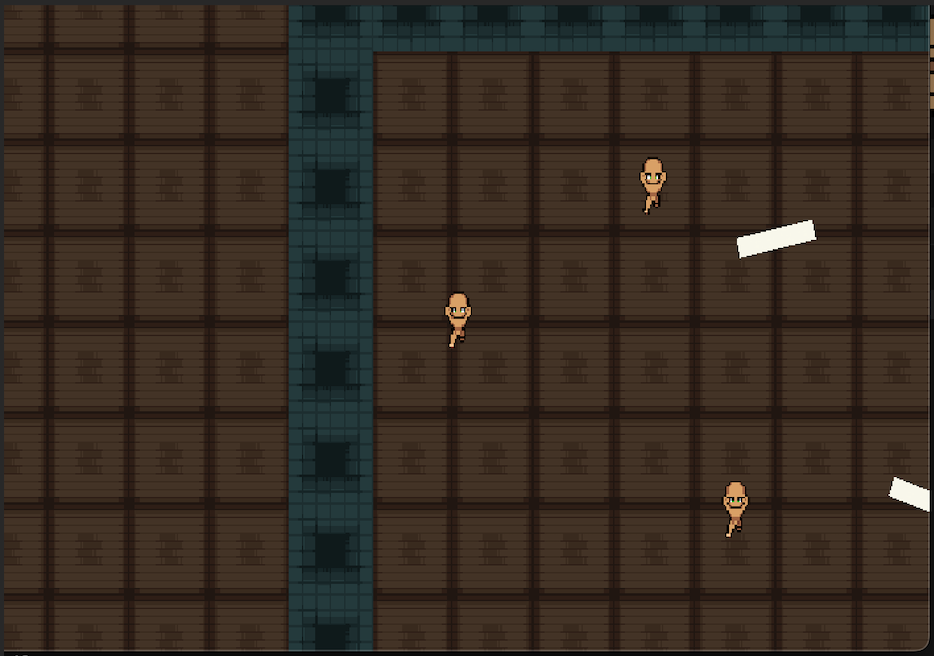

# C++ game. Top-down shooter
---
## Содержание
- [Аннотация](#Аннотация)
- [Архитектура проекта](#Архитектура-проекта)
- [Движок](#Движок)
- [Как собирать](#Как-собирать)
- [Участники](#Участники)
---

## Аннотация

***Top-down Shooter*** (C++ network game) - простая 2d игра с графикой SFML и сетевым интерфейсом.

Technologies are used:
- SFML Network 
- SFML Graphics
- AABB collision
- Threads

Рассмотрим поподробнее структуру проекта.

## Архитектура проекта

- Данный проект содержит серверную часть `TCP_server.hpp` и клиентскую `client_tcp.cpp`. На сервере просиходит подлючение новых игроков, обработка сообщений от них и рассылка `global_sate` всем клиентам (игрокам). На клиенте реализована многопоточность: главный поток занимается рендерингом глобального состояния игры, второй поток занимается сетевой частью, отсылая считанные команды серверу.
- Используются модули `SFML/Network`, `SFML/Graphics`, `SFML/Window`.
- Картинки для спрайтов находятся в папке `Animations`. 
 
## Движок 

Программа считаывает команды с клавиатуры:

[w] - движение вверх

[s] - движение вниз

[a] - движение вправо

[d] - движение влево

[q] - поворот по часовой стрелке 

[e] - поворот против часовой стрелки

---

- Пример рендеринга игры (карта, fps, здоровье игрока и сами персонажи)
---

## Как собирать 

```bash
  mkdir build
```
```bash
  cmake -DCMAKE_BUILD_TYPE=Release -S . -B build
```
```bash
  cmake --build build
```

Для Сервера:
```bash
  bin/server
```

Для Клиента:
```bash
   bin/client N
```
N - номер игрока.

## Участники 

- Вехов Владимир
- Ильюшенков Михаил
